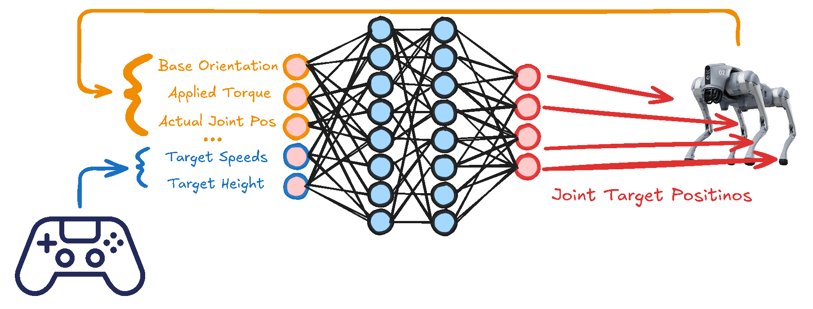

## Making Quadrupeds Learning to Walk: From Zero to Hero

<div><br>
    
</div><br>

Mobile robotics has reached a huge turning point. Thanks to the development and improvment of parallel computation and deep learning, robots are now able to learn complex tasks such as walking, running and jumping. The applications are endless, such as: ispection, search-and-rescue missions, entertainment and even healthcare.

>**Tasks that were once considered impossible for robots are now within reach, and the possibilities are endless. It's just a matter of time before we see robots performing tasks that were once only possible in science fiction.**

In this article, we will guide you through the process of training a quadruped robot to walk using reinforcement learning. We will cover the control policy, actions, observations, reward design, training process, and the transition from simulation to reality. By the end of this guide, you will have a solid understanding of the key components involved in training a quadruped robot to walk!

## 1. Problem Overview

<div><br>
    
</div><br>

In autonomous systems, a fundamental task is tracking reference commands. Usually a high-level controller provides linear and angular speed references, which the robot must follow while maintaining stability and preventing falls. Our final goal will be to track reference speeds generated by a user moving a joystick, while maintaining a desired height and avoid falling.

To achieve this, the robot will have to learn a control policy that maps observations to actions. The observations will include the robot's internal states and external inputs (i.e. user commands), while the actions will be the motor positions that the robot needs to achieve to move accordingly.

This is a really complex task, as the policy has to learn how to balance the robot, move the legs in the right way, and track the reference speeds. This is why reinforcement learning is a good approach for this task, as it allows the robot to learn from its own experience and improve over time.

## 2. Ingredients and RL Framework

A reliable control policy lies at the heart of any robotic locomotion system, acting as the decision-making mechanism that translates high-level objectives into low-level motor commands. The first step is selecting a suitable environment, where the primary focus is on replicating physical constraints while allowing for iterative training. In many cases, this environment can be a simulator equipped with detailed robot models, such as those derived from URDF files, which define the geometry and dynamics of the robotic system. By running experiments in a controlled and often accelerated environment, researchers can quickly gather feedback on different policy configurations while reducing the risk of hardware damage. The simulator can also be augmented with sensor data and randomization factors to expose the policy to varied conditions, promoting robustness that will extend beyond the simulator. 

<div><br>
    
</div><br>

Once the environment is established, it is critical to consider how states, actions, and rewards are designed for effective learning. The state typically includes proprioceptive information, such as joint angles and velocities. Actions correspond to the motor commands needed to drive the robot’s joints, which the policy must produce in response to incoming observations. The reward function is designed to incentivize stable and efficient locomotion, often emphasizing forward progress, energy efficiency and reduced body tilt or impact forces. By balancing these elements, the policy gains a clear sense of what behaviors are desirable and how to achieve them through repeated interaction with the environment.

The reinforcement learning framework itself, such as Proximal Policy Optimization (PPO), serves as the computational spine of the training process. Through iterative updates, it refines the neural network underlying the control policy, assigning suitable weights to different components of the input data. In this network, hidden layers progressively extract relevant features, culminating in outputs that specify joint commands for each gait cycle. Over time, the network learns to anticipate how minute changes in posture or velocity will affect overall stability, enabling smoother and more adaptive movements.

In conclusion, creating a robust control policy for quadruped robots involves much more than a single algorithmic trick. It requires constructing a high-fidelity environment, defining state and action spaces that accurately capture the robot’s capabilities, and training with a clear reward function that drives the policy toward favorable outcomes.

## 3. Learning to Walk
To succesfully train a quadruped robot to walk in a RL environment, we need to define the following key components:

- **Actions**: Depending on the robot's configuration, the actions can be the motor positions that the robot needs to achieve to move accordingly, or torques that the robot needs to apply to its joints. In our case, we will use motor positions as actions.

- **Observations**: The observations represent all the information that the robot can measure or estimate using sensors or sensor fusion techniques. The design of the observation space is crucial for the learning algorithm, as it provides the necessary context for the model to perform effectively.

- **Reward Design**: The reward function is designed to guide the robot to walk effectively while adhering to user-specified references for speed and altitude. Rewards are given for achieving objectives, and penalties are applied when deviations occur.

- **Episode Termination Condition**: Episodes are terminated when specific criteria are met to ensure the robot remains in a healthy and functional state.

### 3.1 Actions

The quadruped robot is equipped with 3 motors per leg, each controlled via position control. This setup results in a 12-dimensional action space, where each dimension corresponds to the reference position for one motor.

To simplify the learning process and "assist" the neural network, we opted to structure the action space as a residual added to a predefined homing position. The homing position represents the robot's default standing posture, with the legs arranged to ensure balance and stability. Instead of directly outputting absolute motor positions, the neural network predicts a residual adjustment relative to this homing posture.

This approach has two key benefits:

- **Simplified Exploration**: By constraining the network’s output to modify a stable baseline, the agent can focus on learning meaningful deviations, reducing the search space for valid actions.
- **Enhanced Stability**: The homing position acts as a natural fallback, preventing erratic movements during the early stages of training when the policy is still unrefined.

Here’s the implementation of the action transformation:

```python
action_total = self.q_homing + residual_action_nn
```

### 3.2 Observations

The observation space represents all the information that the robot can measure or estimate using sensors or sensor fusion techniques. This data is essential for the robot to understand its current situation, allowing it to make informed decisions and take the appropriate actions. A well-defined observation space is critical for the learning algorithm, as it provides the necessary context for the model to perform effectively.

In our case, the robot's observation space will be composed of both the robot's internal states and external inputs (i.e. user commands). 

The main components of the observation space taking into account internal states are as follows:

- **Base Linear Velocities**: $v_x, v_y, v_z$

- **Base Rotational Velocities**: $w_x, w_y, w_z$

- **Orientation Angles**: $\textit{roll, pitch}$

- **Joint Positions**: $q_{1..12}$

- **Joint Velocities**: $\dot{q}_{1..12}$

- **Previous Actions**: $a_{t-1}$

In addition to the robot's internal state, user commands are also incorporated into the observation space to allow for manual control, where an operator moves the robot through a joystick. Thus, the observation space will be enlarged with the following user command inputs:

- **Reference Velocities**: $v_x^{ref}, v_y^{ref}, w_z^{ref}$

- **Reference Robot Altitude**: $z_{ref}$ 

With all these components combined, the final observation space is of the following dimensionality: $\mathbb{R}^{48}$  

### 3.3 Reward Design

The goal of the reward design is to guide the robot to walk effectively while adhering to user-specified references for speed and altitude. In reinforcement learning, the agent is encouraged to maximize its cumulative reward, which is designed to reflect the desired behavior. Rewards are given for achieving objectives, and penalties are applied when deviations occur. Below, we outline the specific reward terms used in our implementation, based on the provided code.

#### 1. **Linear Velocity Tracking Reward**

The robot is encouraged to track $v_x, v_y$ references commanded by the user.

```math
R_{lin\_vel} = \exp[-\|v^{ref}_{xy} - v_{xy}\|^2]
```

Where:
- $v^{ref}_{xy} = [v_x^{ref}, v_y^{ref}]$ is the commanded velocity.
- $v_{xy} = [v_x, v_y]$ is the actual velocity.

#### 2. **Angular Velocity Tracking Reward**

The robot is encouraged to track $w_z$ reference commanded by the user.

```math
R_{ang\_vel} = \exp[-(w^{ref}_{z} - w_{z})^2]
```

Where:
- $w_{cmd,z}$ is the commanded yaw velocity.
- $w_{base,z}$ is the actual yaw velocity.

#### 3. **Height Penalty**

The robot is encouraged to maintain a desired height as specified by the commanded altitude. A penalty is applied for deviations from this target height:

$$
R_{z} = (z - z_{ref})^2
$$

Where:
- $z$ is the current base height.
- $z_{ref}$ is the target height specified in the commands.

#### 4. **Pose Similarity Reward**

To keep the robot's joint poses close to a default configuration, a penalty is applied for large deviations from the default joint positions:

```math
R_{pose\_similarity} = \|q - q_{default}\|^2
```

Where:
- $q$ is the current joint position.
- $q_{default}$ is the default joint position.

#### 5. **Action Rate Penalty**

To ensure smooth control and discourage abrupt changes in actions, a penalty is applied based on the difference between consecutive actions:

```math
R_{action\_rate} = \|a_{t} - a_{t-1}\|^2
```

Where:
- $a_t$ and $a_{t-1}$ are the actions at the current and previous time steps, respectively.

#### 6. **Vertical Velocity Penalty**

To discourage unnecessary movement along the vertical ($z$) axis, a penalty is applied to the squared $z$-axis velocity of the base when the robot is not actively jumping. The reward is:

```math
R_{lin\_vel\_z} = v_{z}^2
```

Where:
- $v_{z}$ is the vertical velocity of the base.

#### 7. **Roll and Pitch Stabilization Penalty**

To ensure the robot maintains stability, a penalty is applied to discourage large roll and pitch deviations of the base. This reward is:

```math
R_{roll\_pitch} = roll^2 + pitch^2
```

Where:
- $roll$ is the roll angle of the base.
- $pitch$ is the pitch angle of the base.

---

This design ensures that the robot learns a balanced policy that prioritizes tracking commands, maintaining stability, and acting smoothly while adhering to physical constraints.

### 3.4 Episode termination condition

During training, episodes are terminated when specific criteria are met to ensure the robot remains in a healthy and functional state. The termination conditions include:
 
- $| \textit{roll} | > \textit{roll}_{\textit{min}}$: Robot roll is below a certain threshold.  
- $| \textit{pitch} | > \textit{pitch}_{\textit{min}}$: Robot pitch is below a certain threshold.  
- $z < z_{\textit{min}}$: Robot altitude is above a minimum value.
- steps ≥ max_steps: Maximum number of steps reached.

Here is an implementation for checking whether the robot is in a healthy state:

```python
# check whether robot current state is healthy
def is_healthy(self, obs, curr_step):
    
    roll = obs[xxx] # rad
    pitch = obs[xxx] # rad
    z = obs[xxx] # rad

    if (abs(roll)>self.roll_th or abs(pitch)>pitch_th or abs(z) < self.z_min or curr_step > self.max_steps):
        return False # dead
    else:
        return True # alive

```

### 3.5 Reset

Whenever a termination condition is met, the episode must be reset, and the robot should start over from the initial state. To encourage exploration and avoid overfitting, some randomness is introduced when reinitializing the robot's starting position.

Specifically, the initial joint positions and velocities are perturbed by adding small random noise:

```math
q_{pos} = q_{pos\_init} + rand(low_{pos}, high_{pos})
```

```math
q_{vel} = q_{vel\_init} + rand(low_{vel}, high_{vel})
```

Where:

- $q_{pos}$: Robot base pose and joint positions after reset.
- $q_{vel}$: Robot base velocities and joint velocities after reset.
- $\textit{rand}(\textit{low}, \textit{high})$: Uniform random noise between $\textit{low}$ and $\textit{high}$.
- $q_{pos\_init}$: Default positions.
- $q_{vel\_init}$: Default velocities.

Here is the code snippet for implementing this reset logic:

```python
# re-initialize robot after reset
qpos = self.qpos_init_sim + self.np_random.uniform(low=noise_pos_low, high=noise_pos_high, size=self.model.nq) 
qvel = self.qvel_init_sim + self.np_random.uniform(low=noise_vel_low, high=noise_vel_high, size=self.model.nv)
```

## 4. Training Process

Reinforcement Learning (RL) formulates the control problem as a Markov Decision Process (MDP), where an agent interacts with an environment to maximize long-term rewards. The objective is to learn an optimal policy $\pi(a | s)$ that selects actions based on observations to maximize the expected cumulative reward over time.

The objective function in RL is:

```math
J(\theta) = \mathbb{E}_{\tau \sim \pi_{\theta}} \left[ \sum_{t=0}^{T} \gamma^t r_t \right]
```

where:
- $\theta$ are the policy parameters,
- $\tau$ is the trajectory sampled from the policy $\pi_{\theta}$,
- $\gamma \in (0,1]$ is the discount factor,
- $r_t$ is the reward at timestep $t$.

A typical RL loop using a simulator follows this structure:

```python
# agent interacting with the environment
for episode in range(num_episodes):
    obs = env.reset()
    done = False
    while not done:
        action = policy(obs)
        obs, reward, done, info = env.step(action)
```

### PPO Algorithm Overview

Proximal Policy Optimization (PPO) is a widely used **on-policy** RL algorithm that improves policy learning by preventing overly large updates. It builds on policy gradient methods but introduces a clipping mechanism to ensure stable training.

The key idea in PPO is to optimize the policy by maximizing a clipped objective:

$$
L^{CLIP}(\theta) = \mathbb{E} \left[ \min(r_t(\theta) A_t, \text{clip}(r_t(\theta), 1-\epsilon, 1+\epsilon) A_t) \right]
$$

where:
- $r_t(\theta) = \frac{\pi_{\theta}(a_t | s_t)}{\pi_{\theta_{old}}(a_t | s_t)}$ is the probability ratio between the new and old policies.
- $A_t$ is the advantage function, which estimates how much better an action is compared to the expected return.
- $\epsilon$ is a small clipping parameter that prevents large policy updates.

By clipping the probability ratio, PPO avoids excessive divergence from the previous policy, leading to more stable and reliable learning.

## 5. From Simulation to Reality

While training and testing in simulated environments offers a fast and safe way to develop algorithms, real-world deployment often reveals significant discrepancies. This is known as **Sim2Real** gap. The discrepancies arise from the fact that simulations typically use idealized or simplified models of the environment and the robot. In reality, factors like sensor noise, unmodeled dynamics, imperfect actuators, environmental variabilities and physical wear are present.

Bridging this gap is crucial for deploying AI systems in robotics, as the algorithms need to generalize to new, unseen real-world conditions, especially in environments where real-world data is limited or too costly to acquire. Typical strategies include *"domain randomization"* or *"domain adaptation"*.

### 5.1 Domain randomization

<div><br>
    
</div><br>

Instead of performing time-consuming and expensive system identification or gathering extensive real-world data, domain randomization deliberately introduces random variations in the simulated environment’s parameters during training, allowing us to artificially create a diverse range of simulation environments. This strategy forces the agent to adapt to a broader set of possible conditions, which in turn helps the model generalize better to real-world scenarios, where conditions may vary due to factors like friction, mechanical noise, etc.

Several parameters in the simulation can be randomized, including:

- **Floor Friction**: Varying the coefficient of friction on surfaces simulates different floor types, weather conditions, or wear on the robot’s legs. This allows the robot to learn strategies that adapt to a variety of environments.

- **Latency**: By randomly adjusting communication delays or actuator response times in the simulation, the robot can learn to handle real-world delays that may affect its control strategies.

- **Physical Parameters**: Modifying parameters such as mass, inertia, battery voltage, and motor friction helps the model account for real-world variations in these key aspects of the robot’s physical characteristics.

- **Sensor Noise**: Introducing random noise to sensory inputs mimics imperfections in real-world sensors, enabling the robot to better handle noisy or imprecise data during operation.

- **Forces**: Applying random forces during the simulation makes the robot robust against external forces (ex: someone pushes or pulls the robot).

Basically, in training, every time there is a termination condition and the episode is reset, besides re-initializing the initial pose and velocities of the robot, there will be a re-initialization accounting also for domain randomization:

```python
# Perform randomization
env_friction = np.random.uniform(self.min_env_friction, self.max_env_friction)   
latency = np.random.uniform(self.min_latency, self.max_latency)      
mass = np.random.uniform(self.min_mass, self.max_mass)        
IMU_bias = np.random.uniform(self.min_IMU_bias, self.max_IMU_bias) 
IMU_std = np.random.uniform(self.min_IMU_std, self.max_IMU_std) 
ext_force = generate_random_force(modulus, direction, duration)
```

By using domain randomization, robotic systems become more adaptable to the real world, and can handle scenarios that they were never directly trained on in simulation. However, a limitation of this approach is that the robot will learn a conservative policy able to generalize on different scenarios, rather than an optimal one tailored to specific conditions.

### 5.2 Adaptation Strategies

To improve the generalization of the robot across various environments, the policy can be conditioned on environment parameters $(\mu)$. By doing so, the robot can adjust its actions based on both its internal state and the dynamics of the environment. However, in real-world scenarios, these environment parameters are not precisely known. If they were, the problem would already be solved. 

#### Latent Representation of Environment Parameters

<div><br>
    
</div><br>

Fortunately, in simulation, the environment parameters are fully available. In this way, at the beginning of each training episode, a random set of environment parameters $\mu$ is sampled according to a probability distribution $p(\mu)$. These parameters can include friction, latency, sensor noise and other factors that influence the dynamics. Predicting the exact system parameters $\mu$ is often unnecessary and impractical, as it may lead to overfitting and poor real-world performance. Instead, a low-dimensional latent embedding $z$ is used. Once $\mu$ is sampled, the environment parameters are encoded into a compact latent space $z$ using an encoder function $e$, represented as:

$$
z_t = e(\mu_t)
$$

Here, $z_t$ serves as a concise representation of the environment's dynamics. This latent variable is then fed as an additional input to the robot’s policy, enabling it to adapt its actions based on the environment:

$$
\pi(a_t \mid o_t, z_t)
$$

Where:
- $a_t$: Action to be taken by the robot.
- $o_t$: Observations.
- $z_t$: Latent encoding of the environment's dynamics.

#### Training the Policy

During training, both the encoder $e$ and policy $\pi$ are jointly optimized using gradient descent based on the reward signals, as a typical reinforcement learning problem. 

#### Real-World Deployment: Adaptation Module

<div><br>
    
</div><br>

In real-world deployment, the robot does not have access to the privileged environment parameters $\mu$. Instead, an *adaptation module* $(\phi)$ is employed to estimate the latent variable $\hat{z}_t$ online. This estimate is derived from the recent history of the robot's states $(x\_{t-k:t-1})$ and actions $(a\_{t-k:t-1})$:

```math
\hat{z}_t = \phi(x_{t-k:t-1}, a_{t-k:t-1})
```

Unlike traditional system identification approaches that attempt to predict the precise environmental parameters $\mu$, this method directly estimates $\hat{z}_t$.

#### Training the Adaptation Module

The adaptation module $\phi$ is trained in simulation, where both the state-action history and the ground truth extrinsics vector $z_t$ are available. This is a typical supervised learning problem, where the objective is to minimize the **mean squared error (MSE)** between $\hat{z}_t$ and $z_t$:

```math
\text{MSE}(\hat{z}_t, z_t) = \| \hat{z}_t - z_t \|^2
```

This training process ensures that the adaptation module learns to accurately predict $\hat{z}_t$ based on historical data.

#### Deployment

Once trained, the adaptation module and policy are ready for real-world deployment. The policy operates as follows:

$$
\pi(a_t \mid o_t, \hat{z}_t)
$$

The adaptation module $\phi$ runs asynchronously at a slower frequency, periodically updating $\hat{z}_t$. The policy uses the most recent $\hat{z}_t$ along with the current observations to determine the robot's actions. This design enables robust and efficient performance across diverse real-world environments while maintaining computational efficiency.

## 6. Key Works and Citations

- **Federico Sarrocco, Leonardo Bertelli (2025)**: [*Making Quadrupeds Learning to Walk: From Zero to Hero*](https://federicosarrocco.com/blog/Making-Quadrupeds-Learning-To-Walk)
- **Ashish Kumar (2022)**: [*Adapting Rapid Motor Adaptation for Bipedal Robots*](https://arxiv.org/pdf/2205.15299)
- **Ashish Kumar (2021)**: [*RMA: Rapid Motor Adaptation for Legged Robots*](https://arxiv.org/pdf/2107.04034)
- **Xue Bin Peng (2020)**: [*Learning Agile Robotic Locomotion Skills by
Imitating Animals*](https://arxiv.org/pdf/2004.00784)
- **Jie Tan (2018)**: [*Sim-to-Real: Learning Agile Locomotion For Quadruped Robots*](https://arxiv.org/pdf/1804.10332)
